# 🤖 AI Chat Uygulaması

AI Chat, Python ve **Flet** kütüphanesi kullanılarak geliştirilmiş, 
çok yönlü ve yapay zekâ destekli bir sohbet uygulamasıdır.  
Bu proje bir **bitirme projesi** olarak hazırlanmış olup, 
**görsel analiz, PDF yorumlama, Excel verisi inceleme ve resim üretme** gibi
GPT benzeri modellerde o dönemde bulunmayan birçok özelliği bünyesinde barındırmaktadır.

---

## 🌟 Genel Özellikler

- 🖼️ **Resim Analizi**: Yüklenen görseller üzerinde renk filtreleme (HSV tabanlı maskeleme), kırmızı/yeşil/mavi tespiti ve akademik/sanatsal açıklama üretme.  
- 📄 **PDF İşlemleri**: Yüklenen PDF dosyaları üzerinde özetleme, yorumlama, güncelleştirme ve içerik ekranına yazdırma.  
- 📊 **Excel Analizi**: Yüklenen Excel dosyalarından özet çıkarma, istatistiksel analiz yapma ve detaylı rapor oluşturma.  
- 📷 **Kamera Entegrasyonu**: Gerçek zamanlı kamera kullanımı ve görsel yakalama.  
- 🎨 **Görüntü Üretimi**: Together API entegrasyonu ile prompt tabanlı resim üretimi.  
- 🌗 **Tema Desteği**: Açık/Koyu mod arasında geçiş yapabilme.  
- 🖥️ **Çoklu Platform**: Windows, macOS, Android, iOS ve tarayıcıda sorunsuz çalışabilir.

---

## 📸 Ekran Görüntüleri

### 🏠 Ana Menü
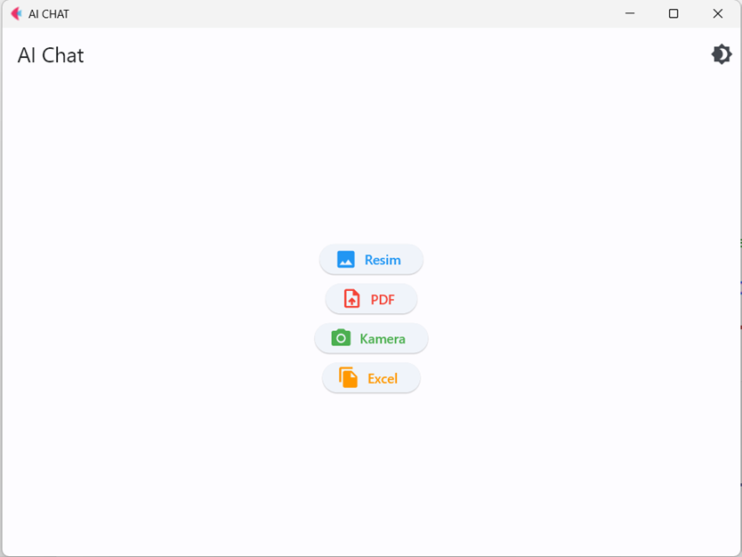

### 🖼️ Resim Modu
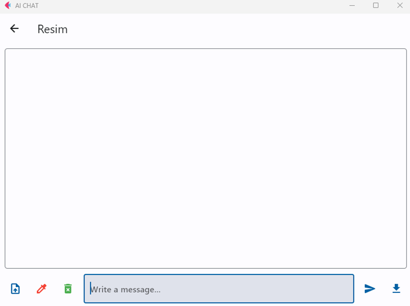

### 🎨 Renk Seçimi
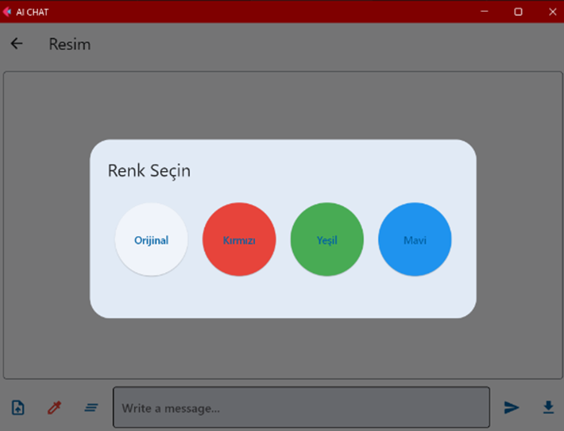

### 📤 Yüklenen Görsel

### 🟩 Yeşil Maske Uygulaması
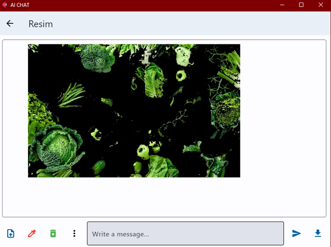

### 🔢 Sınav Görseli (Rakamlar)
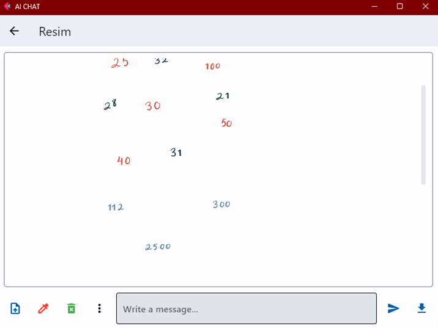

### 🧠 Yapay Zekâ Yanıtı (Sayısal Analiz)
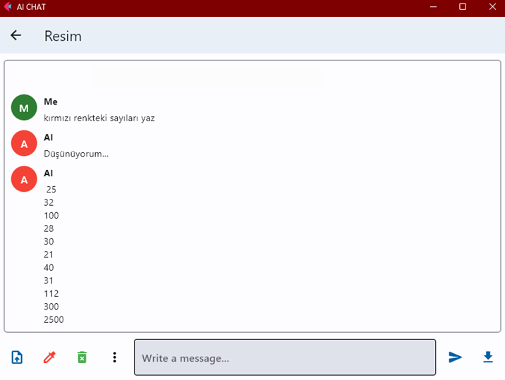

### 🟥 Kırmızı Maske Uygulaması
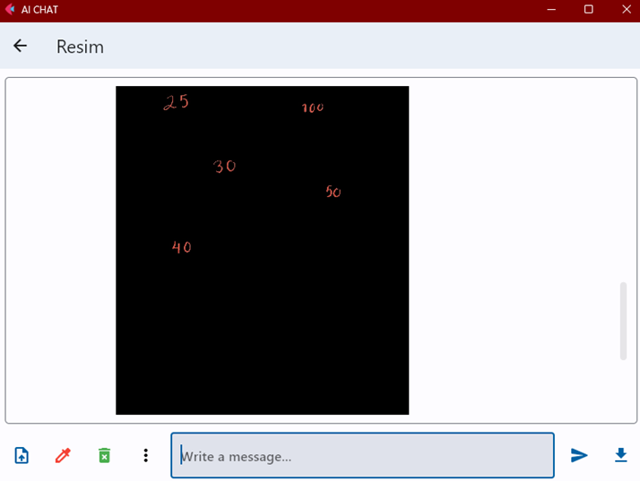

### 📊 Sonuçların Sohbet Ekranı
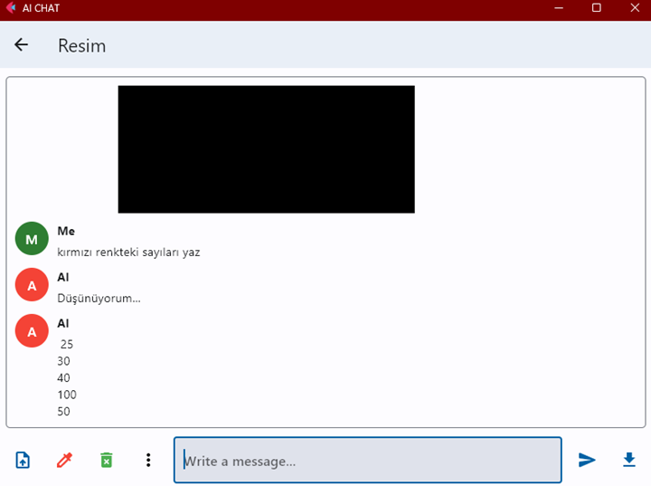

### ⚙️ İşlem Menüsü
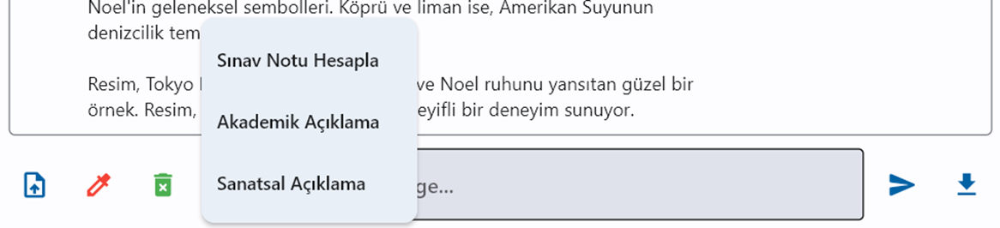

---

## 📊 Excel Modu

### 📑 Yüklenen Excel Verisi
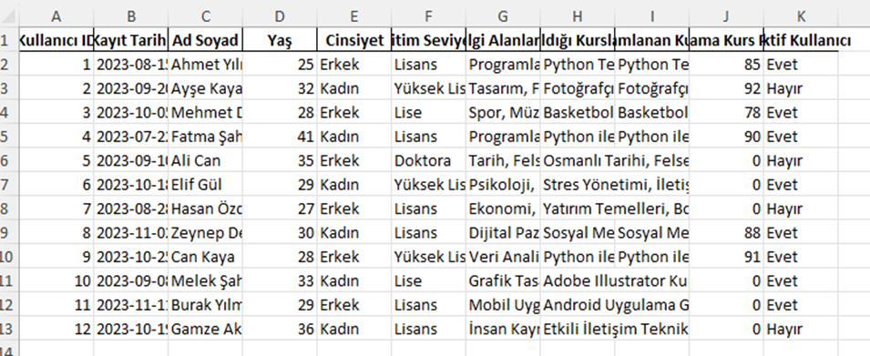

### 📈 AI Analizi Sonucu
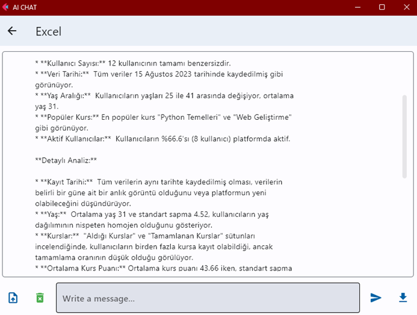

---

## 📄 PDF Modu

### 🗂️ PDF Görünümü
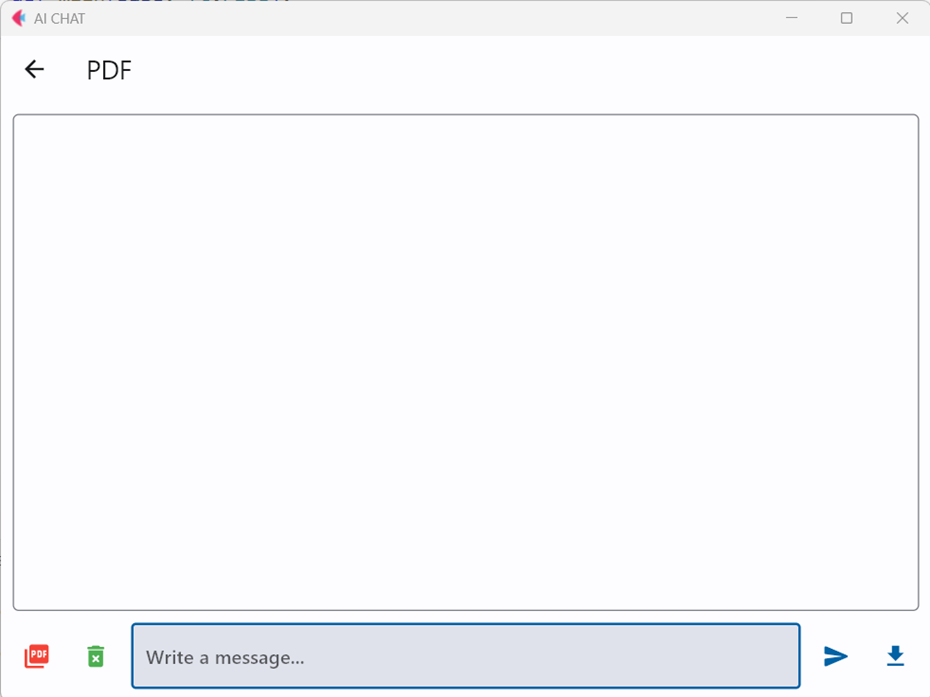

### 📌 PDF İşlem Menüsü
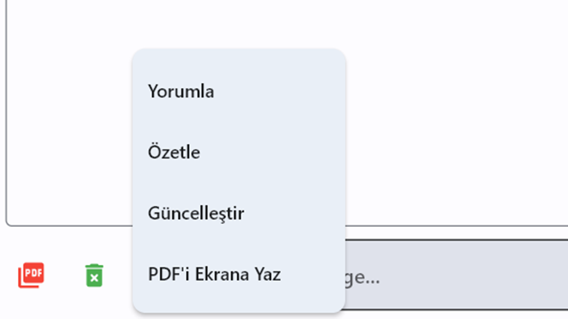

### 📤 PDF Yükleme Ekranı
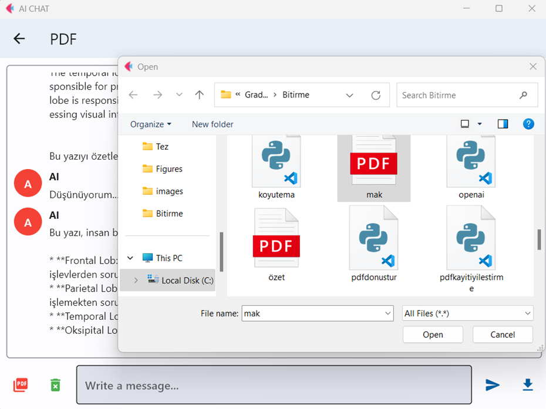

---

## 🚀 Kullanılan Teknolojiler

- **Python 3.11+**
- **Flet** (UI framework)
- **OpenCV** (görsel işleme)
- **Google Generative AI API** (Gemini modelleri)
- **Together API** (görsel üretim)
- **Pandas** (Excel analizi)
- **ReportLab** (PDF üretimi)
- **PyPDF2** (PDF okuma)

---

## 🏆 Projenin Önemi

Bu proje, yalnızca sohbet tabanlı değil; aynı zamanda **görsel, metin ve veri odaklı bir yapay zekâ asistanı** olma özelliğini taşımaktadır.  
Özellikle **detaylı görsel analizini butonlarla yapabilen** ilk uygulamalardan biri olması, 
ve **Flet kütüphanesi** ile geliştirilen çok platformlu yapısıyla, 
döneminde **GPT modellerinde dahi olmayan özellikleri** içermesi yönüyle benzersizdir.
